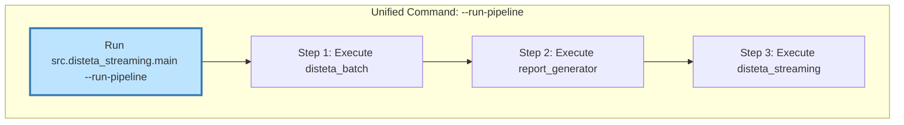
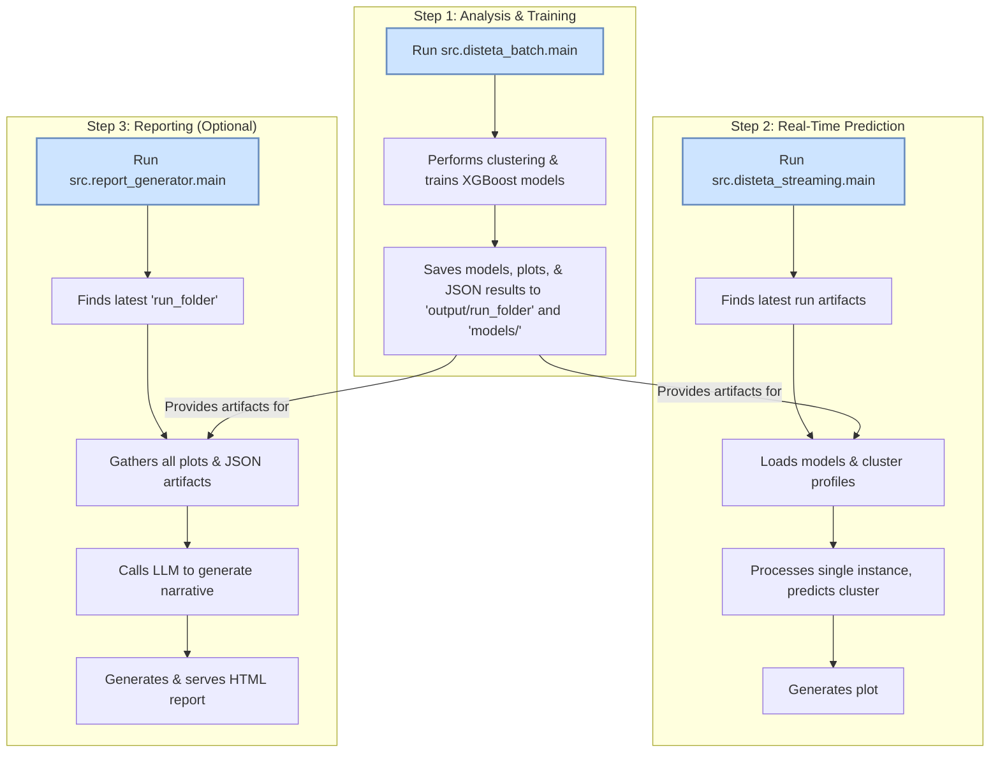
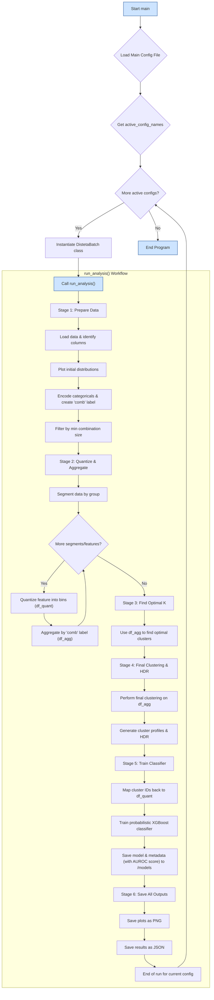
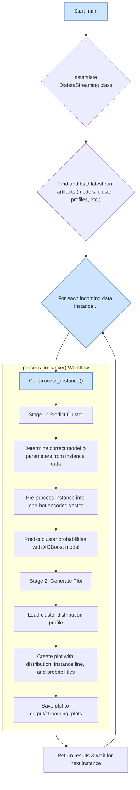

# DistETA: Distributional Analysis, Real-Time Prediction & LLM Reporting

This project provides a robust, multi-stage pipeline for analyzing time-based operational data, making real-time predictions, and generating insightful, human-readable reports using Large Language Models (LLMs). It moves beyond simple averages to understand the full *distribution* of outcomes, identifying distinct, recurring operational patterns.

The pipeline is composed of three main components:

1.  **`disteta_batch` (The Analyzer & Trainer):** A configurable application that performs a distributional analysis on historical data. It uses K-Means clustering to identify distinct operational patterns and then trains an XGBoost classifier to predict which pattern a new data point belongs to.
2.  **`disteta_streaming` (The Predictor):** Simulates a real-time environment by processing individual data points as they arrive. It uses the pre-trained models to predict the cluster for each new instance and generates a plot visualizing the instance against its cluster's distribution.
3.  **`report_generator` (The Reporter):** An agnostic reporting engine that automatically finds the latest analysis output, synthesizes all data and plots using an LLM, and generates a polished, self-contained HTML report that explains the findings in natural language.

## Key Features

-   **Deep Distributional Analysis:** Analyzes the entire probability distribution of a variable, capturing nuances like skewness and multi-modality.
-   **Automated Pattern Discovery:** Automatically segments data into distinct, meaningful clusters representing different performance patterns.
-   **Predictive Modeling:** Trains an XGBoost model on the discovered patterns, enabling real-time classification of new data.
-   **Advanced Predictive Metrics:** Automatically calculates and saves key performance indicators, including accuracy and a weighted AUROC (Area Under the Receiver Operating Characteristic curve) score, providing a nuanced view of model performance.
-   **Probabilistic Predictions:** The classifier outputs the probability for each potential cluster, not just the final prediction. These probabilities are visualized in the real-time plot, offering deeper insight into prediction confidence.
-   **Real-Time Simulation:** A streaming module that processes individual instances and predicts their cluster.
-   **Configurable & Modular:** The entire workflow is controlled via central YAML files.
-   **Multi-LLM Reporting Engine:** Seamlessly switch between Google Gemini and local Ollama models for report generation.
-   **Reproducible Environment:** Ensures a consistent and reliable setup via `pip-tools` and Docker.

## System Workflow

### End-to-End Pipeline Execution

For convenience, the entire pipeline can be orchestrated with a single command. This is the recommended way to run the project.

```bash
python -m src.disteta_streaming.main --run-pipeline
```

This command executes the following steps in sequence:
1.  **Runs `disteta_batch`**: Performs the full analysis and model training.
2.  **Runs `report_generator`**: Generates the HTML report from the new artifacts.
3.  **Runs `disteta_streaming`**: Starts the real-time simulation using the newly trained models.



### High-Level Pipeline

The project operates as a multi-stage pipeline. First, `disteta_batch` runs to analyze data and train models. Then, the `disteta_streaming` and `report_generator` modules can consume these artifacts.



### Detailed Batch Workflow (`disteta_batch.py`)

The `disteta_batch.py` application follows a sophisticated, multi-stage process to uncover hidden patterns and train a predictive model.



### Detailed Streaming Workflow (`disteta_streaming.py`)

The `disteta_streaming.py` application simulates a real-time environment, processing one data point at a time.



## Project Structure

*   **`assets/`**: Contains static resource files like images and audio clips used in documentation.
*   **`config/`**: Contains all YAML configuration files.
    *   `config_disteta.yaml`: Configures the analysis application.
    *   `config_report_generator.yaml`: Configures the reporting application and LLM prompts.
*   **`data/`**: Directory to store your input data files (e.g., `.csv`, `.parquet`).
*   **`models/`**: Contains the saved XGBoost models and their corresponding metadata files.
*   **`output/`**: Default directory where all generated run folders are saved.
    *   **`streaming_plots/`**: Contains the plots generated by the real-time streaming module.
*   **`scripts/`**: Holds small, one-off utility or testing scripts.
*   **`src/`**: The main source code directory.
    *   `constants.py`: A centralized file for shared, project-wide constants.
    *   `disteta_batch/`: The main analysis and model training application.
    *   `disteta_streaming/`: The real-time prediction and plotting application.
    *   `report_generator/`: The LLM-based reporting application.
*   **`tests/`**: Pytest tests.
*   **`README.md`**: The main project readme.