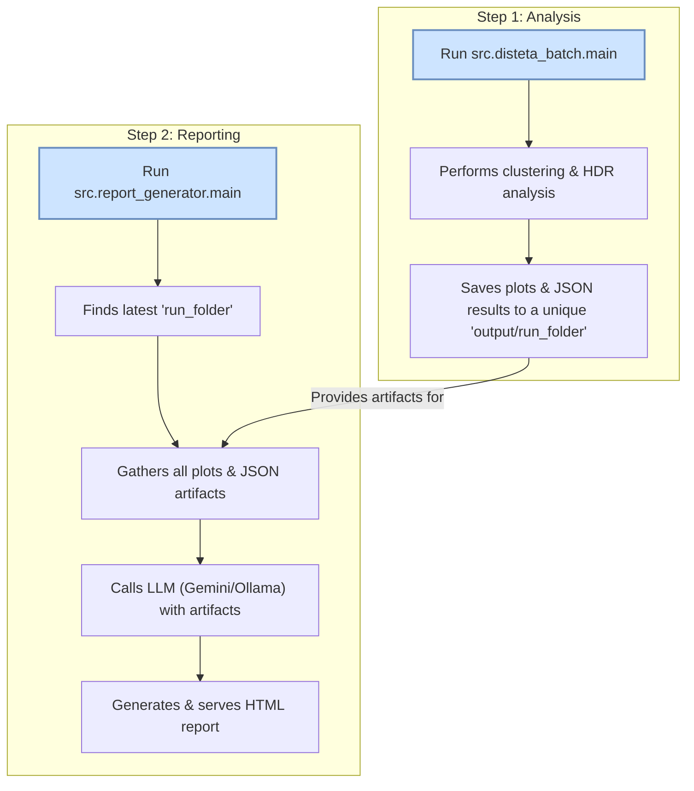
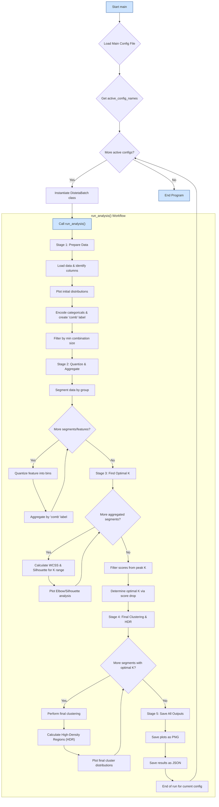

# DistETA: Distributional ETA Analysis & LLM Reporting

This project provides a robust, two-part pipeline for analyzing time-based operational data and generating insightful, human-readable reports using Large Language Models (LLMs). It moves beyond simple averages to understand the full *distribution* of outcomes, identifying distinct, recurring operational patterns.

The pipeline is composed of two main components:

1.  **`disteta_batch` (The Analyzer):** A configurable application that performs a distributional analysis on continuous variables (like travel or dwell times). It uses K-Means clustering to identify distinct operational patterns (behaviors) and characterizes them using High-Density Regions (HDRs).

2.  **`report_generator` (The Reporter):** An agnostic reporting engine that automatically finds the latest analysis output, synthesizes all data and plots using an LLM (Google Gemini or a local Ollama model), and generates a polished, self-contained HTML report that explains the findings in natural language.

The pipeline is designed to be modular and configurable, making it ideal for integration into a larger data infrastructure or "control tower."

## Key Features

-   **Deep Distributional Analysis:** Instead of relying on simple averages, the system analyzes the entire probability distribution of a variable, capturing nuances like skewness, multi-modality, and variability.
-   **Automated Pattern Discovery:** Automatically segments complex operational data into distinct, meaningful clusters representing different performance patterns (e.g., "fast and consistent trips," "highly variable trips").
-   **Configurable & Modular:** The analysis workflow is controlled via a central YAML file, allowing for easy setup of different datasets and parameters without changing the code.
-   **Multi-LLM Reporting Engine:** Seamlessly switch between Google's powerful cloud-based Gemini models and various local, private models via Ollama to generate reports.
-   **LangChain Orchestration:** The reporting engine uses the LangChain framework to create a modular and extensible pipeline for gathering artifacts, formatting prompts, and interacting with different LLM providers.
-   **Agnostic & Decoupled:** The reporting engine is fully decoupled from the analysis script, capable of processing any valid output folder.
-   **Reproducible Environment:** A `requirements.txt` file, generated via `pip-tools`, ensures a consistent and reliable setup.
-   **Static & Interactive Plots:** Configure the report to use static PNG images (for visual analysis by the LLM) or interactive HTML plots (for a more dynamic and explorable final report).

## System Workflow

### High-Level Pipeline

The project operates as a two-stage pipeline. First, the `disteta_batch` application runs a deep analysis and saves the results. Second, the `report_generator` consumes these results to create a narrative report.



### Detailed Analysis Workflow (`disteta_batch.py`)

The `disteta_batch.py` application follows a sophisticated, multi-stage process to uncover hidden patterns in your data, as detailed in the workflow below.



#### 1. Feature Engineering & Combination
The analysis begins by creating unique "profiles" or "combinations" from your categorical data. For example, a combination could represent `{weekday: 'Monday', vehicle_type: 'Heavy'}`. This allows the system to analyze the performance of these specific scenarios.

#### 2. Data Quantization
Continuous data, like travel time, is inherently noisy. To identify broad patterns, the script discretizes the continuous variable into a set of bins (e.g., 100 bins). Each bin represents a small range of the variable (e.g., 5.0 to 5.5 hours). This process turns a continuous distribution into a "fingerprint" or histogram for each data point.

#### 3. Combination Profile Aggregation
The script then aggregates these quantized "fingerprints" for each unique categorical combination. The result is a profile for each combination, showing the distribution of its outcomes across all the bins. This is the core data that will be clustered.

#### 4. Optimal Cluster (K) Selection
To avoid manual guesswork, the system automatically determines the best number of clusters (`K`) for the data. It iterates through a range of potential `K` values and calculates two key metrics:
-   **WCSS (Elbow Method):** Measures the compactness of clusters. The "elbow" of the WCSS plot suggests a point of diminishing returns for adding more clusters.
-   **Silhouette Score:** Measures how similar a data point is to its own cluster compared to others. A higher score indicates better-defined, more distinct clusters.
The script uses a combination of these metrics to select the most statistically significant number of clusters.

#### 5. K-Means Clustering
Using the optimal `K`, the script applies the K-Means algorithm. It groups all the unique combination profiles into K final clusters. Each cluster now represents a distinct meta-pattern or "behavior" (e.g., "low-time, low-variability behavior" vs. "high-time, high-variability behavior").

#### 6. High-Density Region (HDR) Analysis
For each final cluster, the script identifies its High-Density Region. The HDR represents the most probable range of outcomes for that behavior. For example, it might find that "Cluster 0" has an HDR of `[4.5 - 5.2 hours]`, meaning trips exhibiting this behavior are most likely to finish within this time frame.

## Project Structure

*   **`assets/`**: Contains static resource files like images and audio clips used in documentation.
*   **`config/`**: Contains all YAML configuration files.
    *   `config_disteta.yaml`: Configures the analysis application.
    *   `config_report_generator.yaml`: Configures the reporting application and LLM prompts.
*   **`data/`**: Directory to store your input data files (e.g., `.csv`, `.parquet`).
*   **`output/`**: Default directory where all generated run folders are saved. Each run creates a unique subfolder.
*   **`scripts/`**: Holds small, one-off utility or testing scripts.
*   **`src/`**: The main source code directory.
    *   `constants.py`: A centralized file for shared, project-wide constants like directory names (`output`, `config`) and other static values used by both the analysis and reporting modules.
    *   `disteta_batch/`: The main analysis application package.
        *   `main.py`: The entry point script for the analysis.
        *   `utils/`: Helper modules for clustering, data processing, etc.
    *   `report_generator/`: The LLM-based reporting application package.
        *   `main.py`: The entry point script for generating reports.
*   **`requirements.txt`**: A list of all Python dependencies required for the project.
*   **`README.md`**: This file.

## Scripts and Notebooks

This project includes utility scripts and notebooks located in the `scripts/` directory to aid in development and exploration.

### `EDA.ipynb`

A Jupyter Notebook for performing Exploratory Data Analysis (EDA) on the project's datasets (`truck_arrival_data.csv` and `df_XXI.parquet`).

-   **Purpose**: To provide a starting point for understanding the data's structure, distributions, and basic statistics.
-   **Features**:
    -   Loads the two main datasets.
    -   Displays DataFrame info, head, and descriptive statistics.
    -   Generates interactive plots using **Plotly** for all numerical and categorical columns, allowing for dynamic exploration of the data.

To use it, open the notebook in a Jupyter environment (like VS Code or Jupyter Lab) and run the cells.

### `google_genai_models.py`

A command-line script to fetch and list all available Google Gemini models associated with your API key.

-   **Purpose**: To help you identify the correct model names to use in the `config_report_generator.yaml` configuration file.
-   **Features**:
    -   Connects to the Google AI API using the `GOOGLE_API_KEY` environment variable.
    -   Prints a detailed list of all available models, including their name, description, token limits, and supported methods.
    -   If `pandas` is installed, it also prints a clean, tabular summary of the models.
-   **Usage**: To help you identify the correct model names to use in the `config_report_generator.yaml` configuration file.
    ```bash
    python scripts/google_genai_models.py
    ```

## Setup and Installation

### Prerequisites

-   Python 3.10+
-   An API key for Google Gemini (if using the Gemini provider). Set it as an environment variable named `GOOGLE_API_KEY`:
    ```bash
    export GOOGLE_API_KEY="your_api_key_here"
    ```
-   Ollama installed and running with at least one multimodal model pulled (e.g., `ollama pull llava`) if using the Ollama provider.

### Installation Steps

1.  **Clone or download the project** to a dedicated directory on your system.

2.  **Navigate into the project's root directory** in a terminal.

3.  **Create and activate a Python virtual environment:** (This is a one-time setup)
    ```bash
    python -m venv venv
    source venv/bin/activate  # On macOS/Linux
    # or
    .\venv\Scripts\activate   # On Windows
    ```

4.  **Install the required dependencies** into your active virtual environment:
    ```bash
    pip install -r requirements.txt
    pip install -r requirements-dev.txt # For development tools like ruff and pytest
    ```

## Usage Workflow

The pipeline is a two-step process: first you run the analysis, then you generate the report. The commands below assume you are running them from the project's root directory.

### Step 1: Configure and Run the Analysis

1.  **Place your data** in the `data/` directory.
2.  **Edit `config/config_disteta.yaml`:**
    -   Set `active_config_names` to a list of configuration blocks you want to run (e.g., `["truck_data_config", "port_sines_config"]`).
    -   Inside your chosen config block, update `input_data_path` to point to your data file.
    -   Define your `categorical`, `continuous_to_analyze`, and `grouping_column` according to your dataset's schema.
    -   Adjust other parameters like `min_combination_size_input` and `quantization_n_classes_input` as needed (or use the included "auto" methods)

3.  **Run the analysis script as a module:**
    ```bash
    python -m src.disteta_batch.main
    ```
    This will create a new timestamped folder inside the `output/` directory containing the analysis results.

### Step 2: Configure and Generate the Report

1.  **Edit `config/config_report_generator.yaml`:**
    -   Edit `config/config_report_generator.yaml`. Under the `llm` section, set the `provider` to either `"gemini"` or `"ollama"`.
    -   If using Ollama, ensure `ollama_model_name` matches a model you have pulled.
    -   (Optional) Customize the `llm_prompt_template` to change the structure or tone of the report.

2.  **Run the report generator script as a module:**
    ```bash
    python -m src.report_generator.main
    ```
    The script will automatically find the latest run folder, generate the report, save it, and open it in your browser.

### Advanced Usage (Report Generator)

-   **Generate a report for a specific run (not the latest):**
    ```bash
    python -m src.report_generator.main --run-directory "output/path_to_your_specific_run_folder"
    ```

-   **Only serve the latest report without re-generating it:**
    ```bash
    python -m src.report_generator.main --serve-only
    ```

## Configuration Details

The behavior of the pipeline is controlled by two YAML files in the `config/` directory.

### `config_disteta.yaml`

This file configures the main analysis script. You can define multiple analysis blocks (like `truck_data_config`) and choose which one(s) to run by listing them under `active_config_names`.

**Key Parameters to Configure:**

-   **`io.input_data_path`**: Path to your source data file (e.g., `"data/my_data.csv"`).
-   **`columns`**: Defines the roles of your columns.
    -   `grouping_column`: (Optional) The column to segment your data by (e.g., `"route"`). Each group is analyzed independently. Set to `null` to analyze the entire dataset as a whole.
    -   `categorical`: A list of columns to be treated as categorical features. These are used to create the unique operational profiles.
    -   `continuous_to_analyze`: The primary continuous variable you want to analyze (e.g., `"total_time"`).

-   **`preprocessing.min_combination_size_input`**: A crucial parameter that filters out rare, noisy combinations of features to ensure the discovered clusters are statistically significant.
    -   **`"auto-knee"` (Recommended):** Automatically finds the "knee" or "elbow" in the data's distribution to set a threshold. This is the most adaptive method.
    -   **`"auto-knee(S=...)`:** Fine-tune the knee-finder's sensitivity. A smaller `S` (e.g., `S=0.1`) is **less aggressive** and keeps more data. A larger `S` (e.g., `S=2.0`) is **more aggressive**. This is useful when the default `auto-knee` removes too much or too little data for a specific dataset.
    -   **`"pXX"`:** A robust alternative that uses a percentile. For example, `"p20"` sets the threshold at the 20th percentile, removing the 20% least frequent combination types.
    -   **`Integer`:** A manual override to set a hardcoded minimum size (e.g., `15`).

-   **`preprocessing.quantization_n_classes_input`**: Sets the number of bins for discretizing the continuous data.
    -   **`"auto"` (Recommended):** Automatically calculates the optimal number of bins for each data segment using the Freedman-Diaconis rule, adapting to the spread and size of the data.
    -   **`Integer`:** Manually sets a fixed number of bins (e.g., `100`).

-   **`clustering.cluster_range_max`**: The maximum number of clusters (K) to test during the automatic K-selection process.

-   `hdr_analysis.hdr_threshold_percentage`: This value defines the size of the High-Density Region (HDR). It represents the percentage of low-density data to "flood" or ignore, leaving only the highest-density peaks.
    -   For example, a value of `85.0` will identify the region(s) containing the top `(100 - 85) = 15%` of the most frequent outcomes.
    -   A **higher value** results in a **smaller, more exclusive** HDR (e.g., `95.0` finds the top 5% of the densest data).
    -   A **lower value** results in a **larger, more inclusive** HDR (e.g., `50.0` finds the top 50%).

### `config_report_generator.yaml`

This file configures the reporting engine.

-   **`llm.provider`**: Sets the LLM service to use.
    -   `"gemini"`: Uses Google's Gemini models via their cloud API. Requires a `GOOGLE_API_AI` environment variable.
    -   `"ollama"`: Uses a locally-hosted model via Ollama. Requires Ollama to be running.
-   **`llm.gemini_model_name` / `llm.ollama_model_name`**: The specific model name to use for the chosen provider.
-   **`llm.plot_type`**: Determines the format of the plots generated and embedded in the report.
    -   `"static"` (default): Generates standard PNG images. These are sent to the LLM for visual analysis.
    -   `"interactive"`: Generates interactive HTML plots (using Plotly). The LLM is instructed to embed these using `<iframe>` tags, making the final report more dynamic and explorable.
-   **`llm_prompt_template`**: The master prompt that instructs the LLM. You can customize this to radically change the report's output, style, and structure.

## Containerization with Docker

This project is fully containerized using Docker and Docker Compose, which simplifies setup and ensures a consistent environment.

### Prerequisites

-   Docker Desktop installed and running on your system.

### Environment Setup

For the report generator to use Google's Gemini models, you need to provide an API key.

1.  Create a file named `.env` in the project's root directory.
2.  Add your API key to this file:

    ```
    GOOGLE_API_KEY="your_api_key_here"
    ```

Docker Compose will automatically load this variable and make it available to the `report_generator` container.

### Usage with Docker Compose

The `docker-compose.yml` file defines services for each step of the pipeline.

#### Step 1: Run the Analysis

First, run the analysis using the `analyze` profile. This will build the Docker image and run the `disteta_batch` script. The results will be saved to the `output/` directory on your host machine.

```bash
docker-compose --profile analyze up --build
```

This command will run, generate the output, and then the container will stop.

#### Step 2: Generate and Serve the Report

Once the analysis is complete, you can generate the report and start the web server using the `report` profile.

```bash
docker-compose --profile report up --build
```

This will start the `report_generator` service, which finds the latest analysis run, generates the report, and serves it. You can access the report in your browser at **http://localhost:5001**.

#### Combined Analysis and Reporting

To run the entire pipeline in a single command (analyze, then generate the report, then serve), use the `analyze_report` profile. This is the most convenient option for a full run.

```bash
docker-compose --profile analyze_report up --build
```

The server will start, and you can access the newly generated report at **http://localhost:5001**.

#### Using a Local LLM (Ollama)

If you have Ollama running on your host machine and want to use it instead of Gemini:

1.  In `config/config_report_generator.yaml`, set the `provider` to `"ollama"`.
2.  Run both the `report_generator` and the `ollama` proxy service together:

    ```bash
    docker-compose --profile ollama up --build
    ```

The `report_generator` container will now be able to communicate with your local Ollama instance.

## Testing

This project uses `pytest` for testing. Tests are located in the `tests/` directory and include both unit and integration tests.

### Running Tests Locally

1.  **Prerequisites**: Ensure you have installed the development dependencies:
    ```bash
    pip install -r requirements-dev.txt
    ```

2.  **Running All Tests**: To run all tests, navigate to the project's root directory and execute:
    ```bash
    pytest
    ```

3.  **Excluding Slow Tests**: Some tests are marked as `slow` (e.g., full integration tests). To exclude them and run only the faster unit tests, use the `-m` marker flag:
    ```bash
    pytest -m "not slow"
    ```

### Running Tests Inside Docker
To ensure the application works correctly within its containerized environment, you can run the `pytest` suite inside a container. A dedicated `test` profile is configured for this purpose.

Run the following command from your project's root directory:

```bash
docker-compose --profile test up --build --abort-on-container-exit --remove-orphans
```

The test results will be printed to your console, and the container will automatically stop and be removed.